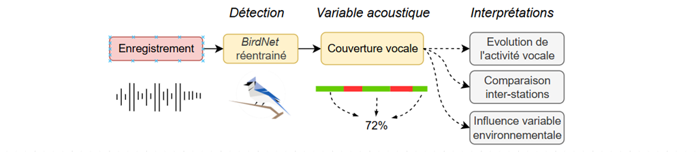
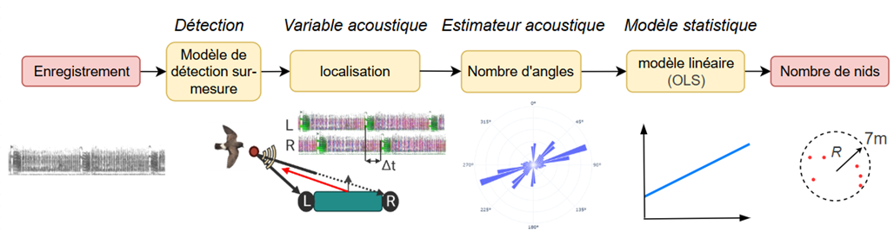
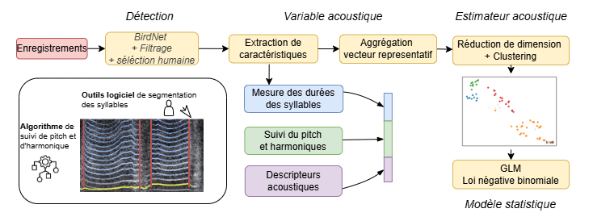
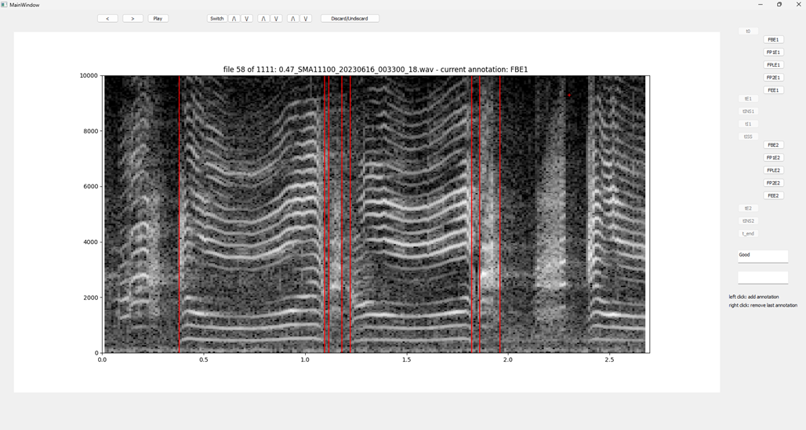

# Suivi acoustique passif – Océanite tempête et Puffin de Scopoli

Ce dépôt regroupe les scripts utilisés pour analyser des enregistrements acoustiques passifs acquis dans le cadre d’un suivi de l’**Océanite tempête** et du **Puffin de Scopoli**.

Il permet de mettre en œuvre trois grands types d’analyses :

1. une **analyse de présence / absence** commune aux deux espèces ;
2. une **analyse d’estimation d’abondance pour l’Océanite tempête** ;
3. une **chaîne d’analyse multi-étapes pour l’estimation d’abondance du Puffin de Scopoli**.

> **Important**  
> Ce dépôt a été structuré pour un usage opérationnel simple. Il vise avant tout à rendre les scripts utilisables, lisibles et transmissibles.  
> Certaines parties peuvent encore être améliorées ou harmonisées dans de futurs projets.

---

## 1. Contenu du dépôt

Les principaux workflows disponibles sont résumés ci-dessous.

| Workflow | Espèce | Objectif principal | Script(s) d’entrée |
|---|---|---|---|
| Détection de présence | Océanite tempête / Puffin de Scopoli | Déterminer la présence acoustique de l’espèce cible dans les enregistrements | `scripts/run_species_presence.py` |
| Estimation d’abondance | Océanite tempête | Estimer localement l’abondance autour d’une station à partir des cris inspirés et de l’information stéréo | `scripts/run_oceanite_abundance.py` |
| Estimation d’abondance | Puffin de Scopoli | Détection, segmentation, clustering et visualisation pour une analyse plus fine | `scripts/run_puffin_abundance_estimation.py` |

---

## 2. Structure du projet

```text
project/
├── README.md
├── requirements.txt
├── environment.yml
├── models/
│   ├── birdnet_calonectris_CustomClassifier_bandpassed_350_5000.tflite
│   ├── birdnet_calonectris_CustomClassifier_bandpassed_350_5000_Labels.txt
│   ├── birdnet_hydrobates_CustomClassifier_bandpassed_600_2500.tflite
│   ├── birdnet_hydrobates_CustomClassifier_bandpassed_600_2500_Labels.txt
│   └── purring_call_detector.model
└── scripts/
    ├── run_species_presence.py             #Worflow 1
    ├── run_oceanite_abundance.py           #Worflow 2
    ├── run_puffin_candidate_selection.py   #Worflow 3
    ├── puffin_segmentation_gui   #Worflow 3
    └── run_puffin_abundance_estimation.py  #Worflow 3
```

---

## 3. Environnement et dépendances

Les scripts nécessitent :

- Python : VERSION 3.10
- des bibliothèques Python listées dans ```requirements.txt```
- **Docker** pour l’analyse de détection de présence si l’inférence BirdNET est exécutée dans une image Docker
---
## 4. Installation 


```Bash
conda env create -f environment.yml
conda activate basom-acoustics
```

### 4.1 Docker 

Pour la détection de présence, Docker doit être installé et fonctionnel sur la machine.

Vérification rapide :

```Bash
docker --version
```

Sinon Télécharger et installer docker desktop (https://www.docker.com/products/docker-desktop/).


Puis intaller l'image docker ```birdnet_v1.3.1_v2.tar (birdnet:v1.3.1_v2)```
- Demander à l'équipe bioPhonia l'image docker : contact@biophonia.fr
- Lancer docker desktop (Lors du 1er lancement, laisser les paramètres par défaut, inutile de créer un compte).
- Lancer la commande ```docker load -i "C:\Chemin\vers\birdnet_v1.3.1_v2.tar"``` depuis un terminal pour ajouter l'image à docker desktop (cette opération peut prendre quelques minutes).
---
## 5. Organisation des données

Les scripts sont conçus pour fonctionner sur une arborescence organisée par année, puis par station.

Exemple :

```txt
data/
└── 2025/
    ├── ST01/
    │   ├── audio_001.wav
    │   ├── audio_002.wav
    │   └── ...
    ├── ST02/
    │   ├── audio_001.wav
    │   └── ...
    └── ST03/
        └── ...
```

**Recommandations**
- un dossier par année de campagne ;
- un sous-dossier par station d’enregistrement ;
- les fichiers audio bruts à l’intérieur de chaque dossier station ;
- éviter de modifier les noms de fichiers si les scripts s’appuient sur leur structure.
- si plusieurs campagnes sont organisées par années, téléversé dans le dossier créé précedement (même année et station). 
---

## 6. Workflow 1 – Détection de présence (Océanite tempête / Puffin de Scopoli)

**Objectifs.** Ce workflow permet de détecter automatiquement la présence acoustique d’une espèce cible dans un ensemble d’enregistrements.



Il repose sur :

- une image Docker ;
- un modèle BirdNET réentraîné ;
- un fichier texte contenant la liste des labels ;
- un script Python qui lance l’inférence et exporte les résultats au format CSV.

### Script principal

```txt
scripts/run_species_presence.py
```

### Entrées attendues
- un dossier annuel structuré par stations ;
- une image Docker prête à l’emploi ;
- un fichier labels.txt (dans le sous-dossier modèle)
- un modèle .tflite (dans le sous-dossier modèle)

### Exemples de commande 

Commande typique pour l'océanite tempête : 

```powershell
python scripts/run_species_presence.py \
    --input-dir data/2025 \
    --output-dir outputs/2025_presence
    --classifier models/birdnet_hydrobates_CustomClassifier_bandpassed_600_2500.tflite"
```

Commande typique pour le puffin de scopoli :

```powershell
python scripts/run_species_presence.py \
    --input-dir data/2025 \
    --output-dir outputs/2025_presence_puffin \
    --classifier models/birdnet_calonectris_CustomClassifier_bandpassed_350_5000_Labels.tflite
```

Mode test :
```powershell
python scripts/run_species_presence.py \
    --input-dir data/2025 \
    --output-dir outputs/test_presence \
    --classifier models/birdnet_calonectris_CustomClassifier_bandpassed_350_5000_Labels.tflite \
    --stations RO1 \
    --debug \
    --debug-max-files 3
```

### Paramètres principaux

- ```--input-dir ```: chemin vers le dossier annuel à analyser
- ```--output-dir ```: chemin vers le dossier de sortie
- ```--classifier ```: chemin vers le model de detection utilisé. 

### Sorties attendues
- un CSV global contenant les scores de détection nommé par défaut : "presence_detection_all_stations.csv"
---

## 7. Workflow 2 – Estimation d’abondance de l’Océanite tempête

### Objectif

Ce workflow permet de détecter spécifiquement les cris inspirés de l’Océanite tempête, d’exploiter l’information stéréo pour calculer des angles d’incidence, puis d’alimenter un estimateur acoustique d’abondance locale.



### Script principal

```txt
scripts/run_oceanite_abundance.py
```

### Principe général

Le workflow comprend les étapes suivantes :

- détection des cris inspirés ;
- extraction de l’information stéréo ;
- calcul des angles d’incidence ;
- calcul d’un estimateur acoustique ;
- prédiction du nombre de nids autour de la station.

### Entrées attendues
- fichiers audio stéréo ;
- modèle d’inférence associé ;

### Exemple de commande

```powershell
python scripts/run_oceanite_abundance.py \
    --input-dir data/2025 \
    --output-dir outputs/2025_oceanite_abundance \
    --classifier models/purring_call_detector.model \
    --date-start 2025-05-01 \ #début mai = début période de ponte
    --date-end 2025-06-15 \ # mi juin = fin de période de ponte
    --start-hour 0 \ # Entre minuit et 3h correspond la période d'activité nocturne maximale 
    --end-hour 3
```

Mode test :

```powershell
python scripts/run_oceanite_abundance.py \
    --input-dir data/2025 \
    --output-dir outputs/test_oceanite_abundance \
    --classifier models/purring_call_detector.model \
    --stations RO1 \
    --date-start 2025-05-01 \
    --date-end 2025-06-15 \
    --start-hour 0 \
    --end-hour 3 \
    --debug \
    --debug-max-files 3
```

### Sorties attendues
Dans ```--output-dir``` :

- ```oceanite_abundance_all_stations.csv```
- ```oceanite_nest_estimation_by_station.csv```
- un CSV par station :
    - ```RO1/oceanite_abundance_RO1.csv```
    - ```RO2/oceanite_abundance_RO2.csv```
- des figures :
    - ```figures/RO1/angles_histo_polar_RO1.png```
    - ```figures/RO1/angles_histo_RO1.png```

### Interprétation

Les résultats doivent être interprétés comme un estimateur et non comme un comptage direct.

Le modèle permet :

- d’obtenir un ordre de grandeur de l’abondance locale ;
- d’estimer le nombre de nids dans un rayon d’environ 7 m autour d’une station ;
- de suivre une tendance de variation en comparant le signe des variations d'une année à l'autre.

Le modèle ne permet pas :

- de fournir un comptage exact ;
- d’estimer fidèlement une variation absolue en nombre de nids dans tous les contextes.

### Vigilance
Les résultats sont à interpréter avec prudence et dans un cadre comparable à celui de calibration du modèle.

---

## 7. Workflow 3 – Estimation d’abondance du puffin de scopoli

### Objectif

Ce workflow regroupe les scripts et l’outil de segmentation utilisés pour estimer l’abondance du Puffin de Scopoli à partir d’enregistrements acoustiques passifs.



### Organisation des scripts 

Le pipeline est organisé en trois étapes :

1. **présélection automatique des vocalisations d’intérêt**
2. **validation et segmentation manuelle via une interface graphique**
3. **calcul des features, clustering, visualisations et estimation du nombre de nids**

Les trois outils principaux sont :

| Étape | Outil | Rôle |
|---|---|---|
| 1 | `run_puffin_candidate_selection.py` | Détection automatique et présélection des vocalisations d’intérêt |
| 2 | `puffin_segmentation_gui` | Rejet des faux positifs et segmentation manuelle des vocalisations |
| 3 | `run_puffin_abundance_estimation.py` | Calcul des features, clustering, visualisations et estimation du nombre de nids |

> **Important**  
> Ce workflow combine des traitements automatiques et une étape manuelle de validation / segmentation.  
> La qualité des annotations influence directement les résultats des étapes suivantes.
> L'executable puffin_segmentation_gui étant trop volumineux pour être deposé sur github, il peut être téléchargeable avec le lien suivant : [lien](https://biophoniacorse.sharepoint.com/:u:/r/sites/BioPhonia/Shared%20Documents/basom/4-Data/puffin_segmentation_gui.exe?csf=1&web=1&e=OHXF5s). En cas de problème pour le téléchargement contacter : contact@biophonia.fr

### Sorties

Exemple d’arborescence de sortie :

```txt
outputs/
└── 2025_puffin/
    ├── candidate_selection/
    ├── annotations/
    └── abundance_estimation/
```

### 7.1 Étape 1 – Présélection automatique des vocalisations

Cette étape permet de détecter automatiquement les vocalisations d’intérêt du Puffin de Scopoli et d’appliquer une première sélection avant revue manuelle.

**Exemple de commande**

Cas standard : 

```powershell
python scripts/run_puffin_candidate_selection.py \
    --input-dir data/2025 \
    --output-dir outputs/2025_puffin_candidates \
    --presence-classifier models/birdnet_calonectris_CustomClassifier_bandpassed_350_5000_Labels.tflite \
    --date-start 2025-05-15 \
    --date-end 2025-06-15
```

Si les détections avec un modèle Birdnet existent déjà :

```powershell
python scripts/run_puffin_candidate_selection.py \
    --input-dir data/2025 \
    --output-dir outputs/2025_puffin_candidates \
    --presence-csv-name outputs/2025_presence_puffin/presence_detection_all_station.csv \ # à changer en fonction de la location des detections
    --date-start 2025-05-15 \
    --date-end 2025-06-15
```

Avec stations ciblées :

```powershell
python scripts/run_puffin_candidate_selection.py \
    --input-dir data/2025 \
    --output-dir outputs/2025_puffin_candidates \
    --presence-classifier models/birdnet_calonectris_CustomClassifier_bandpassed_350_5000_Labels.tflite \
    --stations ST01 ST02 \
    --date-start 2025-05-15 \
    --date-end 2025-06-15
```

En debug : 

```powershell
python scripts/run_puffin_candidate_selection.py \
    --input-dir data/2025 \
    --output-dir outputs/test_puffin_candidates \
    --presence-classifier models/presence_detection/puffin_birdnet.tflite \
    --stations ST01 \
    --date-start 2025-05-15 \
    --date-end 2025-06-15 \
    --debug \
    --debug-max-files 3
```

### 7.2 Étape 2 – Validation et segmentation manuelle

Cette étape permet :

- de rejeter les faux positifs ;
- de conserver uniquement les vocalisations valides ;
- de placer les marqueurs de segmentation sur les inspirations et expirations.

### lancer l'executable 

Pour chaque stations à traiter : 
-  Coller l'executable ```puffin_segmentation_gui``` dans le dossier des audios créer par le script précédant dans ```outputs/candidate_selection/nom_station```. 
- lancer l'executable en double-cliquant dessus. 

L'interface se compose de la manière suivante : 



### Fonctionnalités principales de l’interface

L’interface `puffin_segmentation_gui` permet de :
- valider ou rejeter les vocalisations candidates ;
- segmenter les vocalisations sur le spectrogramme ;
- annoter certains points temps / fréquence ;
- ajouter un commentaire ;
- écouter l’extrait audio ;
- ajuster l’affichage du spectrogramme.

Elle sert notamment à écarter les faux positifs, les vocalisations non mâles, et les extraits de qualité insuffisante.


**Sortie attendue**
A la fin de l'annotation le dossier de sortie doit ressembler à cela : 

```txt
└── features.csv #fichier contenant les segmentations 
└── puffin_segmentation_gui
└── audio_1.wav
└── audio_2.wav
└── ...
```

### 7.3 Étape 3 – Estimation d’abondance

À partir des annotations de segmentation, cette étape :

- calcule les features acoustiques ;
- applique une réduction de dimension ;
- réalise le clustering ;
produit des visualisations 2D ;
- estime le nombre de nids à partir d’un modèle négatif binomial.

**Exemple de commande**

```powershell
python scripts/run_puffin_abundance_estimation.py \
    --input-dir outputs/2025_puffin/candidate_selection \
    --features-file outputs/2025_puffin/annotations/puffin_annotations_all_stations.csv \
    --output-dir outputs/2025_puffin/abundance_estimation \
    --nb-intercept 0.6884652688315651 \
    --nb-coef-clusters 0.12891930346471553 \
    --nb-coef-outliers 0.1311595166409341
```

**Argument principaux**
- --input-dir : annotations validées
- --output-dir : dossier de sortie
- --stations : liste optionnelle de stations à traiter
- --debug : mode test
- --features-config : configuration des features [À CONFIRMER]
- --umap-config : configuration de réduction de dimension [À CONFIRMER]
- --clustering-config : configuration de clustering [À CONFIRMER]
- --nb-model : chemin vers le modèle négatif binomial [SI SÉPARÉ]

**Sorties attendues**
- table des features
- résultats de réduction de dimension
- résultats de clustering
- figures 2D des clusters
- estimation du nombre de nids par station

## 8. Bonnes pratiques
- conserver les données audio brutes sans modification
- travailler dans un dossier de sortie dédié
tester le pipeline sur une ou deux stations avant lancement complet
- homogénéiser les conventions de segmentation entre annotateurs
- conserver la trace des paramètres utilisés pour le clustering et l’estimation finale.

## 9. Points de vigilance
- la qualité de la segmentation manuelle influence directement les features calculées
- les résultats de clustering dépendent des paramètres choisis
- l’estimation finale du nombre de nids doit être interprétée dans le cadre de calibration du modèle
- les comparaisons entre stations ou entre années doivent être faites avec prudence si le protocole change.
